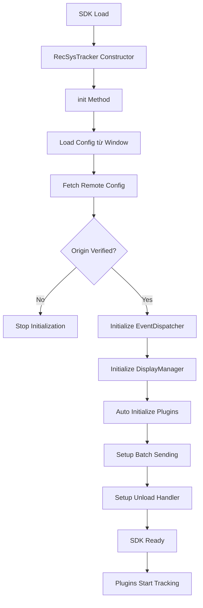

# RecSys Tracker SDK - Architecture Documentation

## Tổng quan

RecSys Tracker SDK là một hệ thống tracking events phức tạp được thiết kế để thu thập và gửi các sự kiện người dùng (clicks, page views, ratings, reviews, scrolls) đến backend. SDK sử dụng kiến trúc plugin-based với hệ thống payload extraction linh hoạt.

## Luồng hoạt động chính



---

## 1. SDK Initialization Flow

### 1.1 Entry Point (`index.ts`)

Khi SDK được load vào trang web:

1. **Constructor được gọi** (`RecSysTracker`)
   - Khởi tạo các core components:
     - `ConfigLoader`: Load config từ window và remote
     - `ErrorBoundary`: Xử lý errors
     - `EventBuffer`: Buffer events trước khi gửi
     - `MetadataNormalizer`: Normalize metadata
     - `PluginManager`: Quản lý plugins
     - `PayloadBuilder`: Xây dựng payload từ data

2. **Auto-initialization**
   ```typescript
   if (document.readyState === 'loading') {
       document.addEventListener('DOMContentLoaded', () => globalTracker?.init());
   } else {
       globalTracker.init();
   }
   ```

### 1.2 Init Method Flow

```typescript
async init(): Promise<void>
```

**Các bước:**

1. **Load config từ window**
   - Đọc `window.RecSysTrackerConfig`
   - Validate config structure

2. **Initialize EventDispatcher**
   - Tạo endpoint URL: `${API_URL}/api/events/track`
   - Setup headers và timeout

3. **Fetch remote config**
   - Gọi API để lấy config từ server
   - Verify origin domain
   - Nếu verification fail → dừng initialization

4. **Update EventDispatcher với domainUrl**
   - Set domainUrl để verify origin khi gửi events

5. **Initialize DisplayManager** (nếu có returnMethods)
   - Load display methods configuration
   - Initialize display components

6. **Auto-initialize plugins**
   - Phân tích tracking rules
   - Tự động load và register plugins cần thiết
   - Start plugins

7. **Setup batch sending**
   - Tạo interval để gửi events theo batch
   - Default: mỗi 2s hoặc khi đủ 10 events

8. **Setup unload handler**
   - Listen `beforeunload`, `pagehide`, `visibilitychange`
   - Gửi remaining events khi user rời trang

---

## 2. Plugin System Architecture

### 2.1 Plugin Manager (`plugin-manager.ts`)

**Vai trò:** Quản lý lifecycle của tất cả plugins

**Core Methods:**

```typescript
class PluginManager {
    private plugins: Map<string, IPlugin> = new Map();
    
    register(plugin: IPlugin): void      // Đăng ký plugin
    unregister(pluginName: string): boolean  // Hủy đăng ký
    start(pluginName: string): boolean   // Start 1 plugin
    stop(pluginName: string): boolean    // Stop 1 plugin
    startAll(): void                     // Start tất cả plugins
    stopAll(): void                      // Stop tất cả plugins
    destroy(): void                      // Cleanup tất cả
}
```

**Workflow:**

1. Plugin được register → `plugin.init(tracker)` được gọi
2. Plugin được start → `plugin.start()` → bắt đầu listen events
3. Plugin được stop → `plugin.stop()` → ngừng listen
4. Plugin được destroy → cleanup resources

### 2.2 Base Plugin (`base-plugin.ts`)

**Interface IPlugin:**

```typescript
interface IPlugin {
    readonly name: string;
    init(tracker: RecSysTracker): void;
    start(): void;
    stop(): void;
    destroy(): void;
    isActive(): boolean;
}
```

**BasePlugin Abstract Class:**

Cung cấp implementation cơ bản cho tất cả plugins:

**Key Features:**

1. **Error Boundary Wrapping**
   - `wrapHandler()`: Wrap sync handlers
   - `wrapAsyncHandler()`: Wrap async handlers
   - Tự động catch và log errors

2. **Payload Identity Resolution**
   ```typescript
   protected resolvePayloadIdentity(extractedData: any): {
       userField: string;
       userValue: string;
       itemField: string;
       itemValue: string;
       value: string;
   }
   ```
   - Tự động detect user/item fields từ extracted data
   - Pattern matching: `UserId`, `Username`, `ItemId`, `ItemTitle`, `Value`

3. **Build and Track Method**
   ```typescript
   protected buildAndTrack(
       context: any,
       rule: any,
       eventId: number,
       additionalFields?: { value?: string; metadata?: Record<string, any> }
   ): void
   ```
   
   **Flow:**
   1. Extract data using `PayloadBuilder.build(context, rule)`
   2. Resolve identity fields dynamically
   3. Construct payload object
   4. Call `tracker.track(payload)`

### 2.3 Concrete Plugins

#### ClickPlugin (`click-plugin.ts`)

**Logic:**

1. Listen `click` events trên document (throttled 300ms)
2. Khi click xảy ra:
   - Lấy tất cả click rules từ config
   - Check xem clicked element có match selector không
   - Nếu match → `buildAndTrack(matchedElement, rule, eventId)`
3. Use AI Item Detector để detect item context

#### PageViewPlugin (`page-view-plugin.ts`)

**Logic:**

1. Track khi page load
2. Track khi URL thay đổi (SPA navigation)
3. Extract data từ URL và page context

#### RatingPlugin (`rating-plugin.ts`)

**Logic:**

1. Listen events trên rating elements
2. Capture rating value
3. Normalize rating value (0-5 scale)
4. Track với `value` field

#### ReviewPlugin (`review-plugin.ts`)

**Logic:**

1. Listen submit events trên review forms
2. Extract review text và rating
3. Track với review content

#### ScrollPlugin (`scroll-plugin.ts`)

**Logic:**

1. Track scroll depth
2. Detect scroll milestones (25%, 50%, 75%, 100%)
3. Track scroll engagement time

---

## 3. Payload Builder System

### 3.1 PayloadBuilder (`payload-builder.ts`)

**Vai trò:** Xây dựng payload từ context và tracking rule

**Architecture:**

```typescript
class PayloadBuilder {
    private extractors: Map<string, IPayloadExtractor> = new Map();
    
    // Registered extractors:
    // - 'element' → ElementExtractor
    // - 'request_body' → NetworkExtractor
    // - 'url' → UrlExtractor
    // - 'cookie', 'local_storage', 'session_storage' → StorageExtractor
}
```

**Build Method Flow:**

```typescript
public build(context: any, rule: TrackingRule): Record<string, any>
```

1. Loop qua tất cả `payloadMappings` trong rule
2. Với mỗi mapping:
   - Lấy `source` (e.g., 'element', 'request_body', 'url')
   - Chọn extractor tương ứng từ Map
   - Gọi `extractor.extract(mapping, context)`
   - Nếu value valid → add vào payload
3. Return payload object

**Example:**

```javascript
// Rule config
{
    payloadMappings: [
        { field: 'UserId', source: 'cookie', value: 'user_id' },
        { field: 'ItemId', source: 'element', value: '.product-id' },
        { field: 'ItemTitle', source: 'element', value: '.product-title' }
    ]
}

// Result payload
{
    UserId: '12345',
    ItemId: 'prod-789',
    ItemTitle: 'Amazing Product'
}
```

---

## 4. Extractor System

### 4.1 IPayloadExtractor Interface

```typescript
interface IPayloadExtractor {
    extract(mapping: PayloadMapping, context?: any): any;
}
```

### 4.2 ElementExtractor (`element-extractor.ts`)

**Purpose:** Extract data từ DOM elements

**Logic:**

1. Nhận `mapping.value` là CSS selector
2. Tìm element:
   - Trong context element (nếu có)
   - Trong document (fallback)
   - Proximity scan (tìm trong parent elements gần nhất)
3. Extract value:
   - Input/Textarea/Select → `.value`
   - Other elements → `.innerText` hoặc `.textContent`

**Example:**

```javascript
// Mapping
{ field: 'ItemTitle', source: 'element', value: '.product-title' }

// Context: <div class="product-card">...</div>
// Tìm .product-title trong product-card hoặc toàn document
```

### 4.3 NetworkExtractor (`network-extractor.ts`)

**Purpose:** Extract data từ network requests/responses

**Logic:**

1. Validate context có chứa network data
2. Check URL pattern matching (nếu có `requestUrlPattern`)
3. Extract based on source:
   - `request_body` → traverse `context.reqBody`
   - `response_body` → traverse `context.resBody`
   - `network_request` → try request first, then response
4. Traverse object using dot notation path

**Example:**

```javascript
// Mapping
{ 
    field: 'UserId', 
    source: 'request_body', 
    value: 'user.id',
    requestUrlPattern: '/api/products/*'
}

// Context
{
    url: '/api/products/123',
    reqBody: { user: { id: '456' } }
}

// Result: '456'
```

### 4.4 UrlExtractor (`url-extractor.ts`)

**Purpose:** Extract data từ URL (query params, path)

**Logic:**

1. Parse current URL
2. Extract query parameters
3. Extract path segments
4. Return requested value

### 4.5 StorageExtractor (`storage-extractor.ts`)

**Purpose:** Extract data từ browser storage

**Logic:**

1. Based on source:
   - `cookie` → parse document.cookie
   - `local_storage` → localStorage.getItem()
   - `session_storage` → sessionStorage.getItem()
2. Return value

---

## 5. Event Tracking Flow

### 5.1 Track Method

```typescript
track(eventData: {
    eventTypeId: number;
    trackingRuleId: number;
    userField: string;
    userValue: string;
    itemField: string;
    itemValue: string;
    value?: string;
}): void
```

**Flow:**

1. Validate SDK initialized
2. Create `TrackedEvent` object:
   ```typescript
   {
       id: generateEventId(),
       timestamp: new Date(),
       eventTypeId,
       trackingRuleId,
       domainKey,
       userField,
       userValue,
       itemField,
       itemValue,
       value
   }
   ```
3. Add to `EventBuffer`

### 5.2 Event Buffer (`event-buffer.ts`)

**Purpose:** Buffer events trước khi gửi

**Methods:**

- `add(event)`: Thêm event vào buffer
- `getBatch(size)`: Lấy batch events
- `removeBatch(ids)`: Remove events đã gửi thành công
- `markFailed(ids)`: Mark events failed
- `getAll()`: Lấy tất cả events

### 5.3 Batch Sending

**Setup:**

```typescript
setupBatchSending(): void {
    const batchDelay = 2000; // 2 seconds
    const batchSize = 10;
    
    setInterval(() => {
        const batch = eventBuffer.getBatch(batchSize);
        sendBatch(batch);
    }, batchDelay);
}
```

**Logic:**

- Mỗi 2s hoặc khi có 10 events → gửi batch
- Nếu thành công → remove khỏi buffer
- Nếu thất bại → mark failed, retry sau

### 5.4 Event Dispatcher (`event-dispatcher.ts`)

**Purpose:** Gửi events đến backend

**Send Strategies:**

1. **SendBeacon** (Priority 1)
   - Non-blocking
   - Reliable khi page unload
   - Browser API: `navigator.sendBeacon()`

2. **Fetch with keepalive** (Priority 2)
   - Fallback nếu sendBeacon fail
   - Support timeout và custom headers

**Send Flow:**

```typescript
async send(event: TrackedEvent): Promise<boolean>
```

1. Verify origin (nếu có domainUrl)
2. Convert event to JSON payload
3. Try sendBeacon
   - Success → return true
   - Fail → try fetch
4. Try fetch with keepalive
   - Success → return true
   - Fail → return false

**Batch Send:**

```typescript
async sendBatch(events: TrackedEvent[]): Promise<boolean>
```

- Gọi `send()` cho từng event
- Return true nếu tất cả thành công

---

## 6. Complete Flow Example: Click Tracking

**Scenario:** User clicks vào product card

### Step-by-step:

1. **User clicks** `.product-card`

2. **ClickPlugin.handleDocumentClick()**
   - Event captured (throttled)
   - Get click rules từ config
   - Check `event.target.closest('.product-card')`
   - Match found!

3. **BasePlugin.buildAndTrack()**
   - Context: `<div class="product-card">...</div>`
   - Rule: 
     ```javascript
     {
         id: 1,
         eventTypeId: 2, // Click
         payloadMappings: [
             { field: 'UserId', source: 'cookie', value: 'user_id' },
             { field: 'ItemId', source: 'element', value: '.product-id' },
             { field: 'ItemTitle', source: 'element', value: '.product-title' }
         ]
     }
     ```

4. **PayloadBuilder.build()**
   - Loop qua 3 mappings
   - Mapping 1: StorageExtractor → extract cookie 'user_id' → '12345'
   - Mapping 2: ElementExtractor → find '.product-id' → 'prod-789'
   - Mapping 3: ElementExtractor → find '.product-title' → 'Amazing Product'
   - Return: `{ UserId: '12345', ItemId: 'prod-789', ItemTitle: 'Amazing Product' }`

5. **BasePlugin.resolvePayloadIdentity()**
   - Detect userField: 'UserId' (matches pattern)
   - Detect itemField: 'ItemId' (matches pattern)
   - Return: 
     ```javascript
     {
         userField: 'UserId',
         userValue: '12345',
         itemField: 'ItemId',
         itemValue: 'prod-789',
         value: ''
     }
     ```

6. **tracker.track()**
   - Create TrackedEvent:
     ```javascript
     {
         id: 'evt-abc123',
         timestamp: '2024-01-15T10:30:00Z',
         eventTypeId: 2,
         trackingRuleId: 1,
         domainKey: 'my-shop.com',
         userField: 'UserId',
         userValue: '12345',
         itemField: 'ItemId',
         itemValue: 'prod-789',
         value: undefined
     }
     ```
   - Add to EventBuffer

7. **Batch Sending (after 2s or 10 events)**
   - EventBuffer.getBatch(10)
   - EventDispatcher.sendBatch(events)

8. **EventDispatcher.send()**
   - Verify origin
   - Convert to JSON
   - Try sendBeacon → Success!
   - Log success
   - Return true

9. **EventBuffer cleanup**
   - Remove sent events from buffer

---

## 7. Key Design Patterns

### 7.1 Plugin Pattern
- Extensible architecture
- Each plugin handles specific event type
- Shared base functionality via BasePlugin

### 7.2 Strategy Pattern
- Multiple extractors for different data sources
- PayloadBuilder selects appropriate extractor based on source

### 7.3 Observer Pattern
- Plugins observe DOM/network events
- React to events and trigger tracking

### 7.4 Builder Pattern
- PayloadBuilder constructs complex payload objects
- Step-by-step extraction and assembly

### 7.5 Error Boundary Pattern
- All operations wrapped in error handlers
- Graceful degradation
- Detailed error logging

---

## 8. Configuration Example

```javascript
window.RecSysTrackerConfig = {
    domainKey: 'my-shop.com',
    domainUrl: 'https://my-shop.com',
    trackEndpoint: 'https://api.tracker.com/api/events/track',
    
    eventTypes: [
        { id: 1, name: 'Page View' },
        { id: 2, name: 'Click' },
        { id: 3, name: 'Rating' }
    ],
    
    trackingRules: [
        {
            id: 1,
            name: 'Product Click',
            eventTypeId: 2,
            trackingTarget: { value: '.product-card' },
            payloadMappings: [
                { field: 'UserId', source: 'cookie', value: 'user_id' },
                { field: 'ItemId', source: 'element', value: '.product-id' },
                { field: 'ItemTitle', source: 'element', value: '.product-title' }
            ]
        }
    ],
    
    options: {
        batchSize: 10,
        batchDelay: 2000
    }
};
```

---

## 9. Summary

**SDK Initialization:**
1. Load config → Verify origin → Initialize components → Auto-load plugins → Start tracking

**Plugin System:**
- PluginManager quản lý lifecycle
- BasePlugin cung cấp shared functionality
- Concrete plugins implement specific tracking logic

**Payload Building:**
- PayloadBuilder orchestrates extraction
- Multiple extractors handle different data sources
- Dynamic field resolution

**Event Tracking:**
- Buffer events → Batch sending → Multiple send strategies → Cleanup

**Key Strengths:**
- Modular và extensible
- Error-resilient
- Flexible data extraction
- Efficient batching
- Reliable delivery (sendBeacon + fetch fallback)
